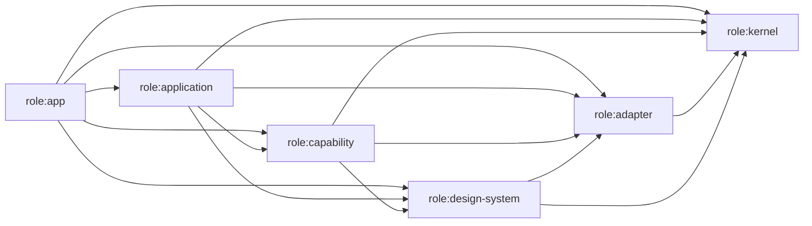

# Generated architecture dependency map

<!-- Generated by `pnpm architecture:map`; do not edit by hand. -->

This snapshot contains **74 Nx projects** and **284 dependencies**. No project cycles detected.

## Target dependency direction

Capability-to-capability dependencies are valid only inside the same named capability. Cross-capability workflows belong in `role:application` projects.

## Role rules

| Source role          | Projects | May depend on                                                                                          |
| -------------------- | -------: | ------------------------------------------------------------------------------------------------------ |
| `role:app`           |        4 | `role:app`, `role:application`, `role:capability`, `role:kernel`, `role:adapter`, `role:design-system` |
| `role:application`   |        8 | `role:application`, `role:capability`, `role:kernel`, `role:adapter`, `role:design-system`             |
| `role:capability`    |       14 | `role:capability`, `role:kernel`, `role:adapter`, `role:design-system`                                 |
| `role:kernel`        |        6 | `role:kernel`                                                                                          |
| `role:adapter`       |        3 | `role:adapter`, `role:kernel`                                                                          |
| `role:design-system` |       29 | `role:design-system`, `role:kernel`, `role:adapter`                                                    |

## Frozen dependency exceptions

The validator compares this table to the live Nx graph exactly. A new edge or a stale exception fails the check.

| Source | Target | Removal issue | Reason |
| ------ | ------ | ------------- | ------ |

## Multi-capability migration projects

The validator compares each project's complete capability set to this ledger.

| Project | Frozen capabilities | Removal issue | Reason |
| ------- | ------------------- | ------------- | ------ |

## Public entrypoints

Every classified library has exactly one explicit primary entrypoint. Additional entrypoints are temporary, exact exceptions with removal issues.

| Project                           | Primary alias                              | Target                                                |
| --------------------------------- | ------------------------------------------ | ----------------------------------------------------- |
| `application-appearance`          | `@trinity/application/appearance`          | `./libs/application/appearance/src/index.ts`          |
| `application-badge`               | `@trinity/application/badge`               | `./libs/application/badge/src/index.ts`               |
| `application-runtime`             | `@trinity/application/runtime`             | `./libs/application/runtime/src/index.ts`             |
| `application-search`              | `@trinity/application/search`              | `./libs/application/search/src/index.ts`              |
| `application-workspace`           | `@trinity/application/workspace`           | `./libs/application/workspace/src/index.ts`           |
| `components-controls`             | `@trinity/components/controls`             | `./libs/components/controls/src/index.ts`             |
| `components-foundations`          | `@trinity/components/foundations`          | `./libs/components/foundations/src/index.ts`          |
| `components-generic-content`      | `@trinity/components/generic-content`      | `./libs/components/generic-content/src/index.ts`      |
| `components-navigation-layout`    | `@trinity/components/navigation-layout`    | `./libs/components/navigation-layout/src/index.ts`    |
| `components-overlay`              | `@trinity/components/overlay`              | `./libs/components/overlay/src/index.ts`              |
| `data-access-accounts`            | `@trinity/data-access/accounts`            | `./libs/data-access/accounts/src/index.ts`            |
| `data-access-auth`                | `@trinity/data-access/auth`                | `./libs/data-access/auth/src/index.ts`                |
| `data-access-discovery`           | `@trinity/data-access/discovery`           | `./libs/data-access/discovery/src/index.ts`           |
| `data-access-gif`                 | `@trinity/data-access/gif`                 | `./libs/data-access/gif/src/index.ts`                 |
| `data-access-homeserver`          | `@trinity/data-access/homeserver`          | `./libs/data-access/homeserver/src/index.ts`          |
| `data-access-identity`            | `@trinity/data-access/identity`            | `./libs/data-access/identity/src/index.ts`            |
| `data-access-matrix-client`       | `@trinity/data-access/matrix-client`       | `./libs/data-access/matrix-client/src/index.ts`       |
| `data-access-media`               | `@trinity/data-access/media`               | `./libs/data-access/media/src/index.ts`               |
| `data-access-notifications`       | `@trinity/data-access/notifications`       | `./libs/data-access/notifications/src/index.ts`       |
| `data-access-room-administration` | `@trinity/data-access/room-administration` | `./libs/data-access/room-administration/src/index.ts` |
| `data-access-room-library`        | `@trinity/data-access/room-library`        | `./libs/data-access/room-library/src/index.ts`        |
| `data-access-timeline`            | `@trinity/data-access/timeline`            | `./libs/data-access/timeline/src/index.ts`            |
| `data-access-trust`               | `@trinity/data-access/trust`               | `./libs/data-access/trust/src/index.ts`               |
| `data-access-widgets`             | `@trinity/data-access/widgets`             | `./libs/data-access/widgets/src/index.ts`             |
| `feature-auth`                    | `@trinity/feature/auth`                    | `./libs/feature/auth/src/index.ts`                    |
| `feature-crypto`                  | `@trinity/feature/crypto`                  | `./libs/feature/crypto/src/index.ts`                  |
| `feature-rooms`                   | `@trinity/feature/rooms`                   | `./libs/feature/rooms/src/index.ts`                   |
| `feature-settings`                | `@trinity/feature/settings`                | `./libs/feature/settings/src/index.ts`                |
| `feature-shell`                   | `@trinity/feature/shell`                   | `./libs/feature/shell/src/index.ts`                   |
| `avatar`                          | `@trinity/helm/avatar`                     | `./libs/spartan/avatar/src/index.ts`                  |
| `badge`                           | `@trinity/helm/badge`                      | `./libs/spartan/badge/src/index.ts`                   |
| `button`                          | `@trinity/helm/button`                     | `./libs/spartan/button/src/index.ts`                  |
| `card`                            | `@trinity/helm/card`                       | `./libs/spartan/card/src/index.ts`                    |
| `checkbox`                        | `@trinity/helm/checkbox`                   | `./libs/spartan/checkbox/src/index.ts`                |
| `dropdown-menu`                   | `@trinity/helm/dropdown-menu`              | `./libs/spartan/dropdown-menu/src/index.ts`           |
| `input`                           | `@trinity/helm/input`                      | `./libs/spartan/input/src/index.ts`                   |
| `label`                           | `@trinity/helm/label`                      | `./libs/spartan/label/src/index.ts`                   |
| `progress`                        | `@trinity/helm/progress`                   | `./libs/spartan/progress/src/index.ts`                |
| `radio-group`                     | `@trinity/helm/radio-group`                | `./libs/spartan/radio-group/src/index.ts`             |
| `select`                          | `@trinity/helm/select`                     | `./libs/spartan/select/src/index.ts`                  |
| `separator`                       | `@trinity/helm/separator`                  | `./libs/spartan/separator/src/index.ts`               |
| `sonner`                          | `@trinity/helm/sonner`                     | `./libs/spartan/sonner/src/index.ts`                  |
| `spinner`                         | `@trinity/helm/spinner`                    | `./libs/spartan/spinner/src/index.ts`                 |
| `switch`                          | `@trinity/helm/switch`                     | `./libs/spartan/switch/src/index.ts`                  |
| `tabs`                            | `@trinity/helm/tabs`                       | `./libs/spartan/tabs/src/index.ts`                    |
| `textarea`                        | `@trinity/helm/textarea`                   | `./libs/spartan/textarea/src/index.ts`                |
| `toggle`                          | `@trinity/helm/toggle`                     | `./libs/spartan/toggle/src/index.ts`                  |
| `toggle-group`                    | `@trinity/helm/toggle-group`               | `./libs/spartan/toggle-group/src/index.ts`            |
| `tooltip`                         | `@trinity/helm/tooltip`                    | `./libs/spartan/tooltip/src/index.ts`                 |
| `utils`                           | `@trinity/helm/utils`                      | `./libs/spartan/utils/src/index.ts`                   |
| `platform-native`                 | `@trinity/platform-native`                 | `./libs/platform-native/src/index.ts`                 |
| `runtime-host`                    | `@trinity/runtime/host`                    | `./libs/runtime/host/src/index.ts`                    |
| `runtime-preferences`             | `@trinity/runtime/preferences`             | `./libs/runtime/preferences/src/index.ts`             |
| `projection-runtime`              | `@trinity/runtime/projection`              | `./libs/runtime/projection/src/index.ts`              |
| `testing`                         | `@trinity/testing`                         | `./libs/testing/src/index.ts`                         |
| `theme-foundation`                | `@trinity/theme-foundation`                | `./libs/theme-foundation/src/index.ts`                |
| `util-matrix`                     | `@trinity/util/matrix`                     | `./libs/util/matrix/src/index.ts`                     |
| `util-push-client`                | `@trinity/util/push-client`                | `./libs/util/push-client/src/index.ts`                |
| `util-ui`                         | `@trinity/util/ui`                         | `./libs/util/ui/src/index.ts`                         |

| Secondary alias | Target | Removal issue | Reason |
| --------------- | ------ | ------------- | ------ |

## Final contraction

The contract is in the `contracted` phase. Classification exceptions, secondary entrypoints, multi-capability projects, dependency exceptions, and migration source baselines must remain empty; the validator rejects any reintroduction.

## Project classifications

| Nx project                        | Root                                   | Architecture metadata                           | Direct dependencies |
| --------------------------------- | -------------------------------------- | ----------------------------------------------- | ------------------: |
| `application-appearance`          | `libs/application/appearance`          | role:application; capability:design-system      |                   4 |
| `application-badge`               | `libs/application/badge`               | role:application; capability:badge              |                   2 |
| `application-runtime`             | `libs/application/runtime`             | role:application; capability:runtime            |                  25 |
| `application-search`              | `libs/application/search`              | role:application; capability:search             |                   5 |
| `application-workspace`           | `libs/application/workspace`           | role:application; capability:workspace          |                   6 |
| `avatar`                          | `libs/spartan/avatar`                  | role:design-system; capability:design-system    |                   1 |
| `badge`                           | `libs/spartan/badge`                   | role:design-system; capability:design-system    |                   1 |
| `button`                          | `libs/spartan/button`                  | role:design-system; capability:design-system    |                   1 |
| `card`                            | `libs/spartan/card`                    | role:design-system; capability:design-system    |                   1 |
| `checkbox`                        | `libs/spartan/checkbox`                | role:design-system; capability:design-system    |                   1 |
| `components-controls`             | `libs/components/controls`             | role:design-system; capability:design-system    |                   9 |
| `components-foundations`          | `libs/components/foundations`          | role:design-system; capability:design-system    |                   1 |
| `components-generic-content`      | `libs/components/generic-content`      | role:design-system; capability:design-system    |                  10 |
| `components-navigation-layout`    | `libs/components/navigation-layout`    | role:design-system; capability:design-system    |                   5 |
| `components-overlay`              | `libs/components/overlay`              | role:design-system; capability:design-system    |                   6 |
| `components-storybook-host`       | `libs/components/storybook-host`       | role:design-system; capability:design-system    |                   1 |
| `data-access-accounts`            | `libs/data-access/accounts`            | role:capability; capability:accounts            |                   4 |
| `data-access-auth`                | `libs/data-access/auth`                | role:capability; capability:accounts            |                   4 |
| `data-access-discovery`           | `libs/data-access/discovery`           | role:capability; capability:discovery           |                   3 |
| `data-access-gif`                 | `libs/data-access/gif`                 | role:capability; capability:conversations       |                   1 |
| `data-access-homeserver`          | `libs/data-access/homeserver`          | role:capability; capability:discovery           |                   1 |
| `data-access-identity`            | `libs/data-access/identity`            | role:capability; capability:identity            |                   4 |
| `data-access-matrix-client`       | `libs/data-access/matrix-client`       | role:adapter; capability:matrix-runtime         |                   4 |
| `data-access-media`               | `libs/data-access/media`               | role:adapter; capability:media                  |                   2 |
| `data-access-notifications`       | `libs/data-access/notifications`       | role:capability; capability:notifications       |                   6 |
| `data-access-room-administration` | `libs/data-access/room-administration` | role:capability; capability:room-administration |                   3 |
| `data-access-room-library`        | `libs/data-access/room-library`        | role:capability; capability:room-library        |                   5 |
| `data-access-timeline`            | `libs/data-access/timeline`            | role:capability; capability:conversations       |                   5 |
| `data-access-trust`               | `libs/data-access/trust`               | role:capability; capability:trust               |                   3 |
| `data-access-widgets`             | `libs/data-access/widgets`             | role:capability; capability:conversations       |                   3 |
| `dropdown-menu`                   | `libs/spartan/dropdown-menu`           | role:design-system; capability:design-system    |                   1 |
| `feature-auth`                    | `libs/feature/auth`                    | role:capability; capability:accounts            |                  11 |
| `feature-crypto`                  | `libs/feature/crypto`                  | role:capability; capability:trust               |                  11 |
| `feature-rooms`                   | `libs/feature/rooms`                   | role:application; capability:workspace          |                  25 |
| `feature-settings`                | `libs/feature/settings`                | role:application; capability:settings           |                  24 |
| `feature-shell`                   | `libs/feature/shell`                   | role:application; capability:trust              |                   4 |
| `input`                           | `libs/spartan/input`                   | role:design-system; capability:design-system    |                   1 |
| `label`                           | `libs/spartan/label`                   | role:design-system; capability:design-system    |                   1 |
| `platform-native`                 | `libs/platform-native`                 | role:adapter; capability:host                   |                   6 |
| `progress`                        | `libs/spartan/progress`                | role:design-system; capability:design-system    |                   1 |
| `projection-runtime`              | `libs/runtime/projection`              | role:kernel; capability:shared                  |                   0 |
| `radio-group`                     | `libs/spartan/radio-group`             | role:design-system; capability:design-system    |                   1 |
| `runtime-host`                    | `libs/runtime/host`                    | role:kernel; capability:host                    |                   0 |
| `runtime-preferences`             | `libs/runtime/preferences`             | role:kernel; capability:preferences             |                   0 |
| `scripts`                         | `scripts`                              | unmanaged tooling/test                          |                   4 |
| `select`                          | `libs/spartan/select`                  | role:design-system; capability:design-system    |                   1 |
| `separator`                       | `libs/spartan/separator`               | role:design-system; capability:design-system    |                   1 |
| `sonner`                          | `libs/spartan/sonner`                  | role:design-system; capability:design-system    |                   1 |
| `spartan-tests`                   | `libs/spartan/tests`                   | role:design-system; capability:design-system    |                  10 |
| `spinner`                         | `libs/spartan/spinner`                 | role:design-system; capability:design-system    |                   1 |
| `switch`                          | `libs/spartan/switch`                  | role:design-system; capability:design-system    |                   1 |
| `tabs`                            | `libs/spartan/tabs`                    | role:design-system; capability:design-system    |                   1 |
| `testing`                         | `libs/testing`                         | unmanaged tooling/test                          |                   0 |
| `textarea`                        | `libs/spartan/textarea`                | role:design-system; capability:design-system    |                   1 |
| `theme-foundation`                | `libs/theme-foundation`                | role:kernel; capability:design-system           |                   0 |
| `toggle`                          | `libs/spartan/toggle`                  | role:design-system; capability:design-system    |                   1 |
| `toggle-group`                    | `libs/spartan/toggle-group`            | role:design-system; capability:design-system    |                   2 |
| `tooltip`                         | `libs/spartan/tooltip`                 | role:design-system; capability:design-system    |                   1 |
| `trinity`                         | `apps/trinity`                         | role:app; capability:composition                |                  10 |
| `trinity-android`                 | `android`                              | role:app; capability:composition                |                   1 |
| `trinity-desktop`                 | `electron`                             | role:app; capability:composition                |                   1 |
| `trinity-e2e`                     | `e2e`                                  | unmanaged tooling/test                          |                   4 |
| `trinity-e2e-android`             | `e2e/android`                          | unmanaged tooling/test                          |                   4 |
| `trinity-e2e-browser`             | `e2e/browser`                          | unmanaged tooling/test                          |                   5 |
| `trinity-e2e-components`          | `e2e/components`                       | unmanaged tooling/test                          |                   7 |
| `trinity-e2e-electron`            | `e2e/electron`                         | unmanaged tooling/test                          |                   3 |
| `trinity-e2e-protocol`            | `e2e/protocol`                         | unmanaged tooling/test                          |                   4 |
| `trinity-e2e-support`             | `e2e/support`                          | unmanaged tooling/test                          |                   0 |
| `trinity-e2e-web`                 | `e2e/web`                              | unmanaged tooling/test                          |                   6 |
| `trinity-ios`                     | `ios`                                  | role:app; capability:composition                |                   1 |
| `util-matrix`                     | `libs/util/matrix`                     | role:kernel; capability:shared                  |                   0 |
| `util-push-client`                | `libs/util/push-client`                | role:kernel; capability:notifications           |                   0 |
| `util-ui`                         | `libs/util/ui`                         | role:design-system; capability:design-system    |                   0 |
| `utils`                           | `libs/spartan/utils`                   | role:design-system; capability:design-system    |                   0 |
