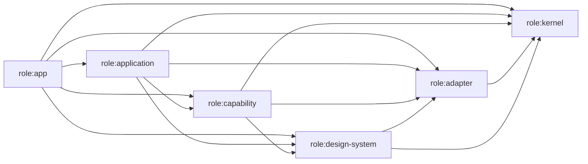

# Generated architecture dependency map

<!-- Generated by `pnpm architecture:map`; do not edit by hand. -->

This snapshot contains **86 Nx projects** and **289 dependencies**. No project cycles detected.

## Target dependency direction

Capability-to-capability dependencies are valid only inside the same named capability. Cross-capability workflows belong in `role:application` projects.

## Role rules

| Source role          | Projects | May depend on                                                                                          |
| -------------------- | -------: | ------------------------------------------------------------------------------------------------------ |
| `role:app`           |        1 | `role:app`, `role:application`, `role:capability`, `role:kernel`, `role:adapter`, `role:design-system` |
| `role:application`   |        6 | `role:application`, `role:capability`, `role:kernel`, `role:adapter`, `role:design-system`             |
| `role:capability`    |       14 | `role:capability`, `role:kernel`, `role:adapter`, `role:design-system`                                 |
| `role:kernel`        |        4 | `role:kernel`                                                                                          |
| `role:adapter`       |        3 | `role:adapter`, `role:kernel`                                                                          |
| `role:design-system` |       54 | `role:design-system`, `role:kernel`, `role:adapter`                                                    |

## Frozen dependency exceptions

The validator compares this table to the live Nx graph exactly. A new edge or a stale exception fails the check.

| Source           | Target             | Removal issue | Reason                                                               |
| ---------------- | ------------------ | ------------- | -------------------------------------------------------------------- |
| `feature-crypto` | `data-access-auth` | #319          | Trust screens currently consume account lifecycle services directly. |

## Multi-capability migration projects

The validator compares each project's complete capability set to this ledger.

| Project                    | Frozen capabilities                                                                                                                     | Removal issue    | Reason                                                                                                                                              |
| -------------------------- | --------------------------------------------------------------------------------------------------------------------------------------- | ---------------- | --------------------------------------------------------------------------------------------------------------------------------------------------- |
| `data-access-room-library` | `capability:room-administration`, `capability:room-library`                                                                             | #318             | Room Administration still consumes the live member projection and shared action-permission adapter while its dedicated boundary is being extracted. |
| `data-access-rooms`        | `capability:discovery`, `capability:room-administration`                                                                                | #318, #321       | Room governance and remote discovery still share one data-access library.                                                                           |
| `data-access-search`       | `capability:conversations`, `capability:discovery`, `capability:room-library`                                                           | #321             | Remote discovery, room queries, and message search still share one library.                                                                         |
| `feature-rooms`            | `capability:conversations`, `capability:discovery`, `capability:room-administration`, `capability:room-library`, `capability:workspace` | #318, #321, #322 | The Workspace application workflow currently contains conversation, room-library, administration, and discovery surfaces.                           |

## Public entrypoints

Every classified library has exactly one explicit primary entrypoint. Additional entrypoints are temporary, exact exceptions with removal issues.

| Project                        | Primary alias                           | Target                                             |
| ------------------------------ | --------------------------------------- | -------------------------------------------------- |
| `application-badge`            | `@trinity/application/badge`            | `./libs/application/badge/src/index.ts`            |
| `application-runtime`          | `@trinity/application/runtime`          | `./libs/application/runtime/src/index.ts`          |
| `application-workspace`        | `@trinity/application/workspace`        | `./libs/application/workspace/src/index.ts`        |
| `components-avatar`            | `@trinity/components/avatar`            | `./libs/components/avatar/src/index.ts`            |
| `components-badge`             | `@trinity/components/badge`             | `./libs/components/badge/src/index.ts`             |
| `components-banner`            | `@trinity/components/banner`            | `./libs/components/banner/src/index.ts`            |
| `components-button`            | `@trinity/components/button`            | `./libs/components/button/src/index.ts`            |
| `components-card`              | `@trinity/components/card`              | `./libs/components/card/src/index.ts`              |
| `components-checkbox`          | `@trinity/components/checkbox`          | `./libs/components/checkbox/src/index.ts`          |
| `components-emoji-picker`      | `@trinity/components/emoji-picker`      | `./libs/components/emoji-picker/src/index.ts`      |
| `components-empty-state`       | `@trinity/components/empty-state`       | `./libs/components/empty-state/src/index.ts`       |
| `components-encryption-dialog` | `@trinity/components/encryption-dialog` | `./libs/components/encryption-dialog/src/index.ts` |
| `components-field`             | `@trinity/components/field`             | `./libs/components/field/src/index.ts`             |
| `components-icon`              | `@trinity/components/icon`              | `./libs/components/icon/src/index.ts`              |
| `components-input`             | `@trinity/components/input`             | `./libs/components/input/src/index.ts`             |
| `components-label`             | `@trinity/components/label`             | `./libs/components/label/src/index.ts`             |
| `components-media-bubble`      | `@trinity/components/media-bubble`      | `./libs/components/media-bubble/src/index.ts`      |
| `components-message-toolbar`   | `@trinity/components/message-toolbar`   | `./libs/components/message-toolbar/src/index.ts`   |
| `components-overlay`           | `@trinity/components/overlay`           | `./libs/components/overlay/src/index.ts`           |
| `components-page-header`       | `@trinity/components/page-header`       | `./libs/components/page-header/src/index.ts`       |
| `components-progress`          | `@trinity/components/progress`          | `./libs/components/progress/src/index.ts`          |
| `components-qr-scanner`        | `@trinity/components/qr-scanner`        | `./libs/components/qr-scanner/src/index.ts`        |
| `components-radio-group`       | `@trinity/components/radio-group`       | `./libs/components/radio-group/src/index.ts`       |
| `components-select`            | `@trinity/components/select`            | `./libs/components/select/src/index.ts`            |
| `components-separator`         | `@trinity/components/separator`         | `./libs/components/separator/src/index.ts`         |
| `components-settings-dialog`   | `@trinity/components/settings-dialog`   | `./libs/components/settings-dialog/src/index.ts`   |
| `components-spinner`           | `@trinity/components/spinner`           | `./libs/components/spinner/src/index.ts`           |
| `components-switch`            | `@trinity/components/switch`            | `./libs/components/switch/src/index.ts`            |
| `components-tabs`              | `@trinity/components/tabs`              | `./libs/components/tabs/src/index.ts`              |
| `components-textarea`          | `@trinity/components/textarea`          | `./libs/components/textarea/src/index.ts`          |
| `components-toggle-group`      | `@trinity/components/toggle-group`      | `./libs/components/toggle-group/src/index.ts`      |
| `components-tooltip`           | `@trinity/components/tooltip`           | `./libs/components/tooltip/src/index.ts`           |
| `components-utils`             | `@trinity/components/utils`             | `./libs/components/utils/src/index.ts`             |
| `data-access-accounts`         | `@trinity/data-access/accounts`         | `./libs/data-access/accounts/src/index.ts`         |
| `data-access-auth`             | `@trinity/data-access/auth`             | `./libs/data-access/auth/src/index.ts`             |
| `data-access-crypto`           | `@trinity/data-access/crypto`           | `./libs/data-access/crypto/src/index.ts`           |
| `data-access-gif`              | `@trinity/data-access/gif`              | `./libs/data-access/gif/src/index.ts`              |
| `data-access-homeserver`       | `@trinity/data-access/homeserver`       | `./libs/data-access/homeserver/src/index.ts`       |
| `data-access-matrix-client`    | `@trinity/data-access/matrix-client`    | `./libs/data-access/matrix-client/src/index.ts`    |
| `data-access-media`            | `@trinity/data-access/media`            | `./libs/data-access/media/src/index.ts`            |
| `data-access-notifications`    | `@trinity/data-access/notifications`    | `./libs/data-access/notifications/src/index.ts`    |
| `data-access-profile`          | `@trinity/data-access/profile`          | `./libs/data-access/profile/src/index.ts`          |
| `data-access-room-library`     | `@trinity/data-access/room-library`     | `./libs/data-access/room-library/src/index.ts`     |
| `data-access-rooms`            | `@trinity/data-access/rooms`            | `./libs/data-access/rooms/src/index.ts`            |
| `data-access-search`           | `@trinity/data-access/search`           | `./libs/data-access/search/src/index.ts`           |
| `data-access-timeline`         | `@trinity/data-access/timeline`         | `./libs/data-access/timeline/src/index.ts`         |
| `data-access-widgets`          | `@trinity/data-access/widgets`          | `./libs/data-access/widgets/src/index.ts`          |
| `feature-auth`                 | `@trinity/feature/auth`                 | `./libs/feature/auth/src/index.ts`                 |
| `feature-crypto`               | `@trinity/feature/crypto`               | `./libs/feature/crypto/src/index.ts`               |
| `feature-rooms`                | `@trinity/feature/rooms`                | `./libs/feature/rooms/src/index.ts`                |
| `feature-settings`             | `@trinity/feature/settings`             | `./libs/feature/settings/src/index.ts`             |
| `feature-shell`                | `@trinity/feature/shell`                | `./libs/feature/shell/src/index.ts`                |
| `avatar`                       | `@trinity/helm/avatar`                  | `./libs/spartan/avatar/src/index.ts`               |
| `badge`                        | `@trinity/helm/badge`                   | `./libs/spartan/badge/src/index.ts`                |
| `button`                       | `@trinity/helm/button`                  | `./libs/spartan/button/src/index.ts`               |
| `card`                         | `@trinity/helm/card`                    | `./libs/spartan/card/src/index.ts`                 |
| `checkbox`                     | `@trinity/helm/checkbox`                | `./libs/spartan/checkbox/src/index.ts`             |
| `dropdown-menu`                | `@trinity/helm/dropdown-menu`           | `./libs/spartan/dropdown-menu/src/index.ts`        |
| `input`                        | `@trinity/helm/input`                   | `./libs/spartan/input/src/index.ts`                |
| `label`                        | `@trinity/helm/label`                   | `./libs/spartan/label/src/index.ts`                |
| `progress`                     | `@trinity/helm/progress`                | `./libs/spartan/progress/src/index.ts`             |
| `radio-group`                  | `@trinity/helm/radio-group`             | `./libs/spartan/radio-group/src/index.ts`          |
| `select`                       | `@trinity/helm/select`                  | `./libs/spartan/select/src/index.ts`               |
| `separator`                    | `@trinity/helm/separator`               | `./libs/spartan/separator/src/index.ts`            |
| `sonner`                       | `@trinity/helm/sonner`                  | `./libs/spartan/sonner/src/index.ts`               |
| `spinner`                      | `@trinity/helm/spinner`                 | `./libs/spartan/spinner/src/index.ts`              |
| `switch`                       | `@trinity/helm/switch`                  | `./libs/spartan/switch/src/index.ts`               |
| `tabs`                         | `@trinity/helm/tabs`                    | `./libs/spartan/tabs/src/index.ts`                 |
| `textarea`                     | `@trinity/helm/textarea`                | `./libs/spartan/textarea/src/index.ts`             |
| `toggle`                       | `@trinity/helm/toggle`                  | `./libs/spartan/toggle/src/index.ts`               |
| `toggle-group`                 | `@trinity/helm/toggle-group`            | `./libs/spartan/toggle-group/src/index.ts`         |
| `tooltip`                      | `@trinity/helm/tooltip`                 | `./libs/spartan/tooltip/src/index.ts`              |
| `utils`                        | `@trinity/helm/utils`                   | `./libs/spartan/utils/src/index.ts`                |
| `platform-native`              | `@trinity/platform-native`              | `./libs/platform-native/src/index.ts`              |
| `runtime-host`                 | `@trinity/runtime/host`                 | `./libs/runtime/host/src/index.ts`                 |
| `runtime-preferences`          | `@trinity/runtime/preferences`          | `./libs/runtime/preferences/src/index.ts`          |
| `projection-runtime`           | `@trinity/runtime/projection`           | `./libs/runtime/projection/src/index.ts`           |
| `testing`                      | `@trinity/testing`                      | `./libs/testing/src/index.ts`                      |
| `util-matrix`                  | `@trinity/util/matrix`                  | `./libs/util/matrix/src/index.ts`                  |
| `util-ui`                      | `@trinity/util/ui`                      | `./libs/util/ui/src/index.ts`                      |

| Secondary alias                    | Target                                              | Removal issue | Reason                                                                            |
| ---------------------------------- | --------------------------------------------------- | ------------- | --------------------------------------------------------------------------------- |
| `@trinity/platform-native/qr-code` | `./libs/platform-native/src/lib/qr-code.service.ts` | #312          | Lets the QR scanner consume one host operation without the broad platform barrel. |

## Source baselines

These are ratcheted snapshots. Any change fails until the measured value and ledger are reviewed and updated together; migration tickets are expected to reduce them toward zero.

| Baseline                   | Current | Frozen value | Removal issue |
| -------------------------- | ------: | -----------: | ------------- |
| Application initializers   |       0 |            0 | complete      |
| Message projection lines   |    1737 |         1737 | #305-#309     |
| Room Library service lines |    1095 |         1095 | #318, #321    |

## Project classifications

| Nx project                     | Root                                | Architecture metadata                                                                                                                           | Direct dependencies |
| ------------------------------ | ----------------------------------- | ----------------------------------------------------------------------------------------------------------------------------------------------- | ------------------: |
| `application-badge`            | `libs/application/badge`            | role:application; capability:badge                                                                                                              |                   2 |
| `application-runtime`          | `libs/application/runtime`          | role:application; capability:runtime                                                                                                            |                   6 |
| `application-workspace`        | `libs/application/workspace`        | role:application; capability:workspace                                                                                                          |                   0 |
| `avatar`                       | `libs/spartan/avatar`               | role:design-system; capability:design-system                                                                                                    |                   1 |
| `badge`                        | `libs/spartan/badge`                | role:design-system; capability:design-system                                                                                                    |                   1 |
| `button`                       | `libs/spartan/button`               | role:design-system; capability:design-system                                                                                                    |                   1 |
| `card`                         | `libs/spartan/card`                 | role:design-system; capability:design-system                                                                                                    |                   1 |
| `checkbox`                     | `libs/spartan/checkbox`             | role:design-system; capability:design-system                                                                                                    |                   1 |
| `components-avatar`            | `libs/components/avatar`            | role:design-system; capability:design-system                                                                                                    |                   3 |
| `components-badge`             | `libs/components/badge`             | role:design-system; capability:design-system                                                                                                    |                   3 |
| `components-banner`            | `libs/components/banner`            | role:design-system; capability:design-system                                                                                                    |                   3 |
| `components-button`            | `libs/components/button`            | role:design-system; capability:design-system                                                                                                    |                   2 |
| `components-card`              | `libs/components/card`              | role:design-system; capability:design-system                                                                                                    |                   2 |
| `components-checkbox`          | `libs/components/checkbox`          | role:design-system; capability:design-system                                                                                                    |                   2 |
| `components-emoji-picker`      | `libs/components/emoji-picker`      | role:design-system; capability:design-system                                                                                                    |                   1 |
| `components-empty-state`       | `libs/components/empty-state`       | role:design-system; capability:design-system                                                                                                    |                   4 |
| `components-encryption-dialog` | `libs/components/encryption-dialog` | role:design-system; capability:design-system                                                                                                    |                   2 |
| `components-field`             | `libs/components/field`             | role:design-system; capability:design-system                                                                                                    |                   2 |
| `components-icon`              | `libs/components/icon`              | role:design-system; capability:design-system                                                                                                    |                   2 |
| `components-input`             | `libs/components/input`             | role:design-system; capability:design-system                                                                                                    |                   2 |
| `components-label`             | `libs/components/label`             | role:design-system; capability:design-system                                                                                                    |                   2 |
| `components-media-bubble`      | `libs/components/media-bubble`      | role:design-system; capability:design-system                                                                                                    |                   1 |
| `components-message-toolbar`   | `libs/components/message-toolbar`   | role:design-system; capability:design-system                                                                                                    |                   5 |
| `components-overlay`           | `libs/components/overlay`           | role:design-system; capability:design-system                                                                                                    |                   6 |
| `components-page-header`       | `libs/components/page-header`       | role:design-system; capability:design-system                                                                                                    |                   1 |
| `components-progress`          | `libs/components/progress`          | role:design-system; capability:design-system                                                                                                    |                   2 |
| `components-qr-scanner`        | `libs/components/qr-scanner`        | role:design-system; capability:design-system                                                                                                    |                   3 |
| `components-radio-group`       | `libs/components/radio-group`       | role:design-system; capability:design-system                                                                                                    |                   2 |
| `components-select`            | `libs/components/select`            | role:design-system; capability:design-system                                                                                                    |                   2 |
| `components-separator`         | `libs/components/separator`         | role:design-system; capability:design-system                                                                                                    |                   2 |
| `components-settings-dialog`   | `libs/components/settings-dialog`   | role:design-system; capability:design-system                                                                                                    |                   1 |
| `components-spinner`           | `libs/components/spinner`           | role:design-system; capability:design-system                                                                                                    |                   2 |
| `components-storybook-host`    | `libs/components/storybook-host`    | role:design-system; capability:design-system                                                                                                    |                   1 |
| `components-switch`            | `libs/components/switch`            | role:design-system; capability:design-system                                                                                                    |                   2 |
| `components-tabs`              | `libs/components/tabs`              | role:design-system; capability:design-system                                                                                                    |                   2 |
| `components-textarea`          | `libs/components/textarea`          | role:design-system; capability:design-system                                                                                                    |                   2 |
| `components-toggle-group`      | `libs/components/toggle-group`      | role:design-system; capability:design-system                                                                                                    |                   4 |
| `components-tooltip`           | `libs/components/tooltip`           | role:design-system; capability:design-system                                                                                                    |                   3 |
| `components-utils`             | `libs/components/utils`             | role:design-system; capability:design-system                                                                                                    |                   1 |
| `data-access-accounts`         | `libs/data-access/accounts`         | role:capability; capability:accounts                                                                                                            |                   4 |
| `data-access-auth`             | `libs/data-access/auth`             | role:capability; capability:accounts                                                                                                            |                   5 |
| `data-access-crypto`           | `libs/data-access/crypto`           | role:capability; capability:trust                                                                                                               |                   2 |
| `data-access-gif`              | `libs/data-access/gif`              | role:capability; capability:conversations                                                                                                       |                   1 |
| `data-access-homeserver`       | `libs/data-access/homeserver`       | role:capability; capability:discovery                                                                                                           |                   1 |
| `data-access-matrix-client`    | `libs/data-access/matrix-client`    | role:adapter; capability:matrix-runtime                                                                                                         |                   4 |
| `data-access-media`            | `libs/data-access/media`            | role:adapter; capability:media                                                                                                                  |                   2 |
| `data-access-notifications`    | `libs/data-access/notifications`    | role:capability; capability:notifications                                                                                                       |                   5 |
| `data-access-profile`          | `libs/data-access/profile`          | role:capability; capability:identity                                                                                                            |                   2 |
| `data-access-room-library`     | `libs/data-access/room-library`     | role:capability; capability:room-library, capability:room-administration                                                                        |                   3 |
| `data-access-rooms`            | `libs/data-access/rooms`            | role:capability; capability:room-administration, capability:discovery                                                                           |                   3 |
| `data-access-search`           | `libs/data-access/search`           | role:capability; capability:discovery, capability:conversations, capability:room-library                                                        |                   3 |
| `data-access-timeline`         | `libs/data-access/timeline`         | role:capability; capability:conversations                                                                                                       |                   5 |
| `data-access-widgets`          | `libs/data-access/widgets`          | role:capability; capability:conversations                                                                                                       |                   3 |
| `dropdown-menu`                | `libs/spartan/dropdown-menu`        | role:design-system; capability:design-system                                                                                                    |                   1 |
| `feature-auth`                 | `libs/feature/auth`                 | role:capability; capability:accounts                                                                                                            |                  15 |
| `feature-crypto`               | `libs/feature/crypto`               | role:capability; capability:trust                                                                                                               |                  15 |
| `feature-rooms`                | `libs/feature/rooms`                | role:application; capability:workspace, capability:conversations, capability:room-library, capability:room-administration, capability:discovery |                  39 |
| `feature-settings`             | `libs/feature/settings`             | role:application; capability:settings                                                                                                           |                  30 |
| `feature-shell`                | `libs/feature/shell`                | role:application; capability:trust                                                                                                              |                   4 |
| `input`                        | `libs/spartan/input`                | role:design-system; capability:design-system                                                                                                    |                   1 |
| `label`                        | `libs/spartan/label`                | role:design-system; capability:design-system                                                                                                    |                   1 |
| `platform-native`              | `libs/platform-native`              | role:adapter; capability:host                                                                                                                   |                   4 |
| `progress`                     | `libs/spartan/progress`             | role:design-system; capability:design-system                                                                                                    |                   1 |
| `projection-runtime`           | `libs/runtime/projection`           | role:kernel; capability:shared                                                                                                                  |                   0 |
| `radio-group`                  | `libs/spartan/radio-group`          | role:design-system; capability:design-system                                                                                                    |                   1 |
| `runtime-host`                 | `libs/runtime/host`                 | role:kernel; capability:host                                                                                                                    |                   0 |
| `runtime-preferences`          | `libs/runtime/preferences`          | role:kernel; capability:preferences                                                                                                             |                   0 |
| `scripts`                      | `scripts`                           | unmanaged tooling/test                                                                                                                          |                   1 |
| `select`                       | `libs/spartan/select`               | role:design-system; capability:design-system                                                                                                    |                   1 |
| `separator`                    | `libs/spartan/separator`            | role:design-system; capability:design-system                                                                                                    |                   1 |
| `sonner`                       | `libs/spartan/sonner`               | role:design-system; capability:design-system                                                                                                    |                   1 |
| `spartan-tests`                | `libs/spartan/tests`                | role:design-system; capability:design-system                                                                                                    |                  10 |
| `spinner`                      | `libs/spartan/spinner`              | role:design-system; capability:design-system                                                                                                    |                   1 |
| `switch`                       | `libs/spartan/switch`               | role:design-system; capability:design-system                                                                                                    |                   1 |
| `tabs`                         | `libs/spartan/tabs`                 | role:design-system; capability:design-system                                                                                                    |                   1 |
| `testing`                      | `libs/testing`                      | unmanaged tooling/test                                                                                                                          |                   0 |
| `textarea`                     | `libs/spartan/textarea`             | role:design-system; capability:design-system                                                                                                    |                   1 |
| `toggle`                       | `libs/spartan/toggle`               | role:design-system; capability:design-system                                                                                                    |                   1 |
| `toggle-group`                 | `libs/spartan/toggle-group`         | role:design-system; capability:design-system                                                                                                    |                   2 |
| `tooltip`                      | `libs/spartan/tooltip`              | role:design-system; capability:design-system                                                                                                    |                   1 |
| `trinity`                      | `apps/trinity`                      | role:app; capability:composition                                                                                                                |                  26 |
| `trinity-desktop`              | `electron`                          | migration exception                                                                                                                             |                   0 |
| `trinity-e2e`                  | `e2e`                               | unmanaged tooling/test                                                                                                                          |                   1 |
| `util-matrix`                  | `libs/util/matrix`                  | role:kernel; capability:shared                                                                                                                  |                   0 |
| `util-ui`                      | `libs/util/ui`                      | role:design-system; capability:design-system                                                                                                    |                   0 |
| `utils`                        | `libs/spartan/utils`                | role:design-system; capability:design-system                                                                                                    |                   0 |
