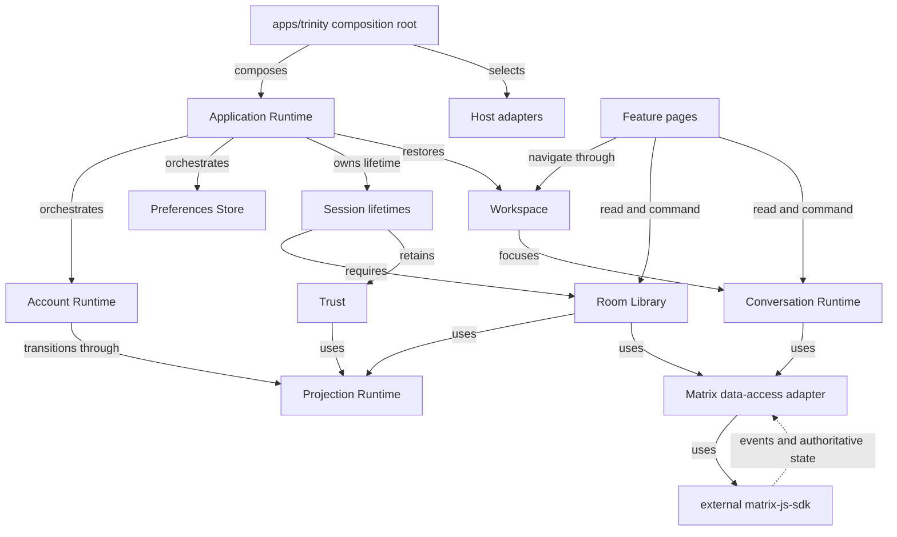
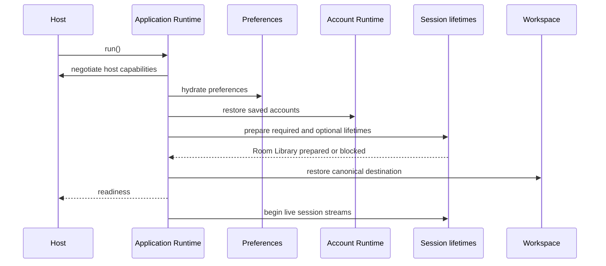

# Architecture

Trinity is one Matrix client rendered by a web application and wrapped by native
and desktop hosts. The repository separates the parts that compose the
application, the capabilities that own Matrix behaviour, and the kernels that
make those capabilities safe to run.

This page explains where ownership lives. For the resolved project names,
entrypoints, tags, and direct edges, use the generated
[dependency map](generated/dependency-map.md). It is the canonical map because
it is derived from the workspace; this guide deliberately does not duplicate a
count or a hand-maintained project list.

## Capability ownership

A capability owns its state, its Matrix or host adapter, and the commands that
change that state. A page presents that capability. The application composition
root wires the capability to a particular host.



Solid arrows are dependency or lifecycle-ownership edges, labelled with their
relationship. The dashed arrow is the external SDK source feeding its adapter.
matrix-js-sdk does not depend on a Trinity kernel. The adapter turns SDK events
into capability projections and invokes SDK commands. Pages do not call
matrix-js-sdk directly. The
[Matrix data-access source](../../libs/data-access/matrix-client/src/lib)
contains the concrete client and projection adapters.

The primary owners are:

| Concern                                                                                   | Owner                    | Responsibility                                                                   |
| ----------------------------------------------------------------------------------------- | ------------------------ | -------------------------------------------------------------------------------- |
| process lifetime, ordered startup, recovery, host-session streams                         | Application Runtime      | starts and stops the application as one owned subscription                       |
| saved accounts, authenticated establishment, active-account switching, sign-out and reset | Account Runtime          | owns account lifecycle and the active pointer                                    |
| Room and Space summaries, invitations, hierarchy, ordering and aggregate unread state     | Room Library             | projects the account-aware library and its mutations                             |
| canonical route, history, account readiness and focused conversation                      | Workspace                | turns semantic navigation into a committed view                                  |
| exact account-and-room timeline-handle focus and retention                                | Conversation Runtime     | retains and retires exact timeline lifetimes within the Conversations capability |
| drafts, media, message commands, threads and pins                                         | Conversations capability | owns the room-bound product behaviour exposed through its data-access API        |
| trust health and verification                                                             | Trust                    | owns trust projections and verification actions                                  |
| context-keyed persisted settings                                                          | Preferences Store        | owns descriptor state and storage operations                                     |
| listener attachment, reconciliation and scoped readiness barriers                         | Projection Runtime       | owns a reusable projection lifecycle                                             |
| Matrix client, sync and SDK persistence                                                   | Matrix data access       | keeps the SDK as the authoritative Matrix state                                  |

The dedicated [state and reactivity guide](state-and-reactivity.md) describes
how these lifetimes join. The [Matrix and encryption guide](matrix-and-encryption.md)
covers client creation, persistence, authentication, and cryptography.

## Dependency roles and public boundaries

Nx tags enforce two ideas: dependencies point inward, and a shared kernel cannot
reach into a Matrix capability. The generated map records the authoritative tags
and edges.

| Role          | Typical location                        | May own                                                              |
| ------------- | --------------------------------------- | -------------------------------------------------------------------- |
| application   | libs/application                        | orchestration that spans capabilities, such as startup and Workspace |
| capability    | libs/data-access and feature libraries  | one product capability and its public read model or commands         |
| adapter       | Matrix and native integration libraries | the host or SDK-specific implementation behind a capability contract |
| kernel        | libs/runtime and shared utilities       | policy-free primitives usable by many capabilities                   |
| design system | libs/components and libs/spartan        | presentational APIs and vendor wrappers                              |
| composition   | apps/trinity and host projects          | provider selection, routes, environment values and bootstrapping     |

Features may depend on data access, public UI, utility, and platform contracts.
They do not depend directly on another feature. A feature that needs a value
from another domain reads the owning data-access signal or receives an
application-level loader or port. It does not create a shortcut import.

The public API for a library is its source index. Import through the
@trinity alias recorded in the generated map, not through another library's
internal files. Keep the Matrix SDK behind data-access libraries. The
[Library boundaries](libraries.md) guide gives the practical placement rules.

## Application startup

Application Runtime has six ordered stages:

1. host negotiation
2. preference hydration
3. account restoration
4. session capabilities
5. Workspace restoration
6. readiness



A stage can return a structured blocked outcome or a recoverable warning.
Application Runtime, rather than an individual capability, decides how to
aggregate and present that result and owns retry, stop, and restart. Diagnostics
must contain stable codes and recovery information only: never account IDs,
tokens, preference values, raw exceptions, or server responses.

Session preparation is not the same as opening live streams. Room Library is a
required preparation lifetime; its selected projections must be prepared before
Workspace restores a destination. Trust, identity, notifications, and room
administration can report initial optional outcomes. Once all required startup
work reaches readiness, Application Runtime opens the readiness gate and starts live
streams while retaining preparation lifetimes. This ordering prevents Workspace from targeting an unprepared
account projection.

Unsubscribing from the runtime's owned subscription stops it. Callers should not
start a second runtime subscription or create competing session lifetimes.

## Where a change belongs

Start with the capability, not the screen that happens to display it.

| If the change is about                                                         | Start here                                        |
| ------------------------------------------------------------------------------ | ------------------------------------------------- |
| a Matrix read model or Matrix command                                          | its data-access capability under libs/data-access |
| account establishment, restore, switching or reset                             | libs/data-access/accounts                         |
| a semantic destination, URL, history or focused room                           | libs/application/workspace                        |
| startup, a host capability, deep link, Back action, badge or recovery          | libs/application/runtime or libs/runtime/host     |
| product preference defaults, validation, scope or storage/export policy        | the capability contributing the descriptor        |
| generic descriptor catalog and context-keyed preference state                  | libs/runtime/preferences                          |
| preference backend persistence operations                                      | the selected storage adapter                      |
| a timeline, draft, message relation, thread, pin or attachment bound to a room | libs/data-access/timeline                         |
| visual composition and user interaction                                        | the owning feature library                        |
| a reusable, domain-neutral control                                             | libs/components; use the public entrypoint        |
| a platform-specific bridge                                                     | the selected adapter or host project              |

Before adding a dependency, inspect the resolved project rather than guessing
from a directory name:

```bash
pnpm nx show project application-runtime --json
pnpm nx show project data-access-accounts --json
pnpm nx graph --print
```

Then run the affected project's declared checks and the relevant user journey.
[Contributing commands](../contributing/commands.md) and
[testing guidance](../contributing/testing.md) explain how to choose them.

## Current design and historical material

These guides describe the current ownership model. The rationale for
capability boundaries belongs in the relevant
[architecture decision records](../adr/0001-capability-ownership-and-dependency-roles.md),
not in a new capability's public contract. The
[historical validation record](final-validation.md) is dated evidence only and
does not establish the current checkout's status. When a change removes a
transitional adapter, update the generated map and the owning contract so that
current readers do not need to infer behaviour from old migration notes.

## Read next

- [Library boundaries](libraries.md) — role, public API, and dependency choices.
- [State and reactivity](state-and-reactivity.md) — projections, Account,
  Workspace, conversations, preferences, and Trust lifetimes.
- [Matrix and encryption](matrix-and-encryption.md) — Matrix client, storage,
  authentication, and end-to-end encryption.
- [Target architecture](target-architecture.md) — current intended contracts and decisions.
- [Historical validation](final-validation.md) — dated evidence and its limits.
