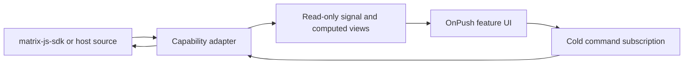
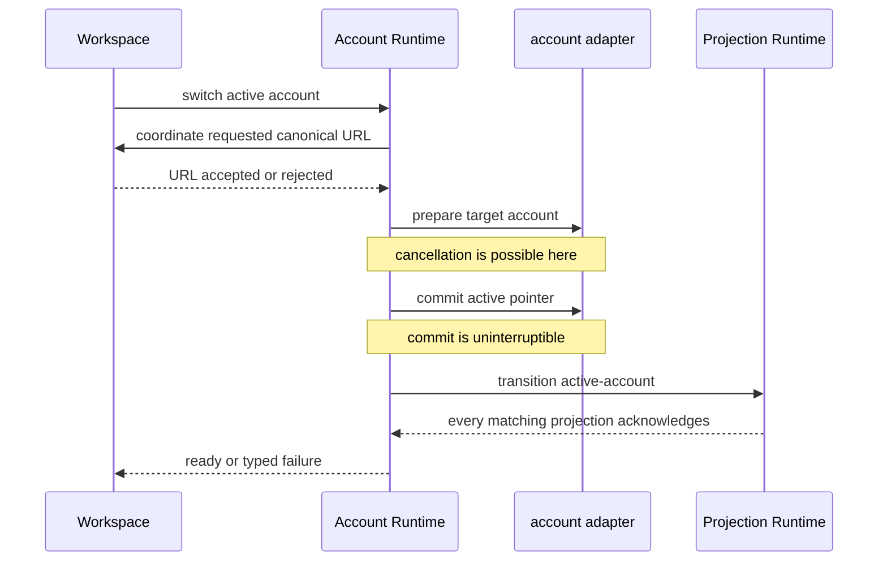

# State and reactivity

Trinity keeps Matrix state in matrix-js-sdk and projects it into application
state. It does not keep a second Redux or entity store. A data-access
capability listens to the authoritative SDK or host source, publishes a
read-only Angular signal, and rebuilds that signal when the source changes.

Use signals for current state a template renders. Use cold RxJS Observables for
one-shot commands that may fail, be cancelled, or need a typed outcome.
Components subscribe for their own lifetime, normally with
takeUntilDestroyed. They do not write another capability's signal or hold an
SDK client.

## The current-state and command boundary



An accepted command does not manually invent a replacement read model. The SDK
event or host callback is projected back into the read-only view. An adapter
can handle an explicit local-echo exception, but a routine write followed by a
hand-written refresh usually means the projection is missing an invalidation
source.

The application is zoneless and its pages and components use OnPush change
detection. A signal write schedules the relevant render. For rendering tests,
use the repository test helper rather than assuming a zone-driven Angular test
environment; [testing](../contributing/testing.md) documents the distinction.

## Projection Runtime

Projection Runtime is the kernel for lifecycle-bound read models. It accepts
four closed scopes: active account, all live accounts, exact account, and exact
conversation. A definition supplies an attachment function, a reconciliation
Observable, a reset function, and optional deterministic resource counts.
The runtime supplies the lifecycle rules:

- it coalesces an invalidation burst to one reconciliation in a microtask;
- every reconciliation has a generation, and a late generation cannot publish;
- it cancels cold reconciliation work when invalidated, replaced, or released;
- it detaches the exact listeners it attached, cancels queued work, and resets
  the owned read model on release; and
- it provides a cold finite readiness barrier with waitFor for a scope.

A capability owns the meaning of its projection. Projection Runtime owns the
attachment, reset, cancellation, and acknowledgement mechanics. It therefore
cannot become a product event bus or a second Matrix store. Its
[service](../../libs/runtime/projection/src/lib/projection-runtime.service.ts)
is the canonical lifecycle implementation.

### Writing a client-backed projection

For an active-client Matrix projection, use
[projectFromClient](../../libs/data-access/matrix-client/src/lib/project-from-client.ts)
rather than recreating listener ownership. Give it a stable ID, rebuild from
the supplied client instance, and list only events that invalidate that model.
It attaches to a client instance, not a connected boolean, coalesces a sync
burst, reprojects across the active-account boundary, and resets on release.
A bespoke listener must be removed by its matching unbind function. For a
selected-account Room Library projection, use its
[cold owned lifetime](../../libs/data-access/room-library/src/lib/selected-room-library.service.ts)
so its attachment and exact cleanup share one subscription.

### Active-account transition

transition(active-account) is the reattachment boundary. It cancels each
matching generation, detaches and resets the old adapter, attaches the new
authoritative source, reconciles it, and finishes only after every new
generation has acknowledged. A caller must wait for this barrier before
publishing a view that relies on active-account projections.

The Room Library lifetime uses this mechanism for its required account-aware
projections. It publishes prepared only after its room, Space, invitation,
hierarchy, and selected projections are ready. If it blocks, Workspace does not
restore a destination against an unprepared library.

## Required startup policy

Application Runtime has one producer-policy ledger for Host contract negotiation, Account
registry restoration, required Room Library preparation, optional preference, Room ordering and
browser storage preparation, Workspace restoration, and final Angular readiness. Preference
composition has a second exhaustive ledger for its twelve independent producers; each has a stable
`hydrate-*` operation, installation context, device-preference storage policy, typed safe-default
and consequence presentation keys, and a 10-second observation budget. Legacy device-preference
initializers return value-free `ready` or `defaulted` evidence, distinguishing a normal absent key
from invalid stored data or unavailable storage. One rejected initializer cannot erase sibling outcomes. A timeout
stops observation; it does not claim to cancel an underlying Promise. Owned work may settle later,
and a late success clears its health without requiring another write, while attempt and
Workspace-navigation generations reject obsolete publication.

| Producer                    | Required | First-result budget | Automatic retries |
| --------------------------- | -------- | ------------------- | ----------------- |
| Host contract               | Yes      | 10 seconds          | 0                 |
| Preference hydration        | No       | 10 seconds each     | 0                 |
| Account registry            | Yes      | 150 seconds         | 0                 |
| Room Library                | Yes      | 15 seconds          | 0                 |
| Room ordering               | No       | 5 seconds           | 0                 |
| Browser storage persistence | No       | 2 seconds           | 0                 |
| Workspace                   | Yes      | 15 seconds          | 0                 |
| Final readiness             | Yes      | 30 seconds          | 0                 |

The complete startup watchdog is 230 seconds: 10 seconds for Host, 10 seconds for the serial
Preference stage, 150 seconds for Accounts, 15 seconds for the longest parallel Session-capability
producer, 15 seconds for Workspace and 30 seconds for Readiness. Preference producers enforce
their own parallel 10-second observations inside that Preference-stage allowance. Room ordering
and browser storage settle in parallel with Room Library and remain below its 15-second stage
budget. Account Runtime also keeps its existing 30-second per-Account deadline
and concurrency of four inside the Account-registry budget. Workspace gives the saved destination
and safe root up to 7 seconds each inside its 15-second stage budget.

The stage order is strict. A Host contract or required Active Account failure blocks before
Room Library work. Room Library must prepare before Workspace restores. An empty Account scope
is valid dormant preparation. Failed saved navigation tries `/` with replace-history semantics;
only failure of both the requested destination and safe root blocks Workspace. Optional Room
ordering settles each Account to the declared recent-activity default and exposes exact scoped
recovery. Denied or unavailable browser persistence keeps best-effort storage while warning that
local data is at greater eviction risk.

Preference hydration publishes one value-free health operation per producer. Appearance, Privacy
and Room Library Account-scope recovery reset only failed descriptors through their declared
defaults. Every fallback presents the consequence selected by its typed policy key. An
authoritatively disabled or removed producer publishes `not-applicable`, invalidates its old
recovery generation, and disappears from problems without announcing a recovery. The long-lived
Appearance effect has no deadline; Application Runtime owns it through stop/restart, and a fault becomes the recoverable `apply-appearance` health operation. Room
ordering similarly publishes opaque per-Account scopes and retires a scope as not applicable when
the Account disappears.

Reset is not atomic. `AppConfigService` owns a per-entry ledger for the exact exported catalogue,
continues an already-started setter after observer timeout or cancellation, and publishes no
values. A partial attempt preserves completed entries and exact retry selects only failed or still
queued/in-progress entries. The Account registry, drafts, push applied-id ledger and per-Account Space
ordering remain structurally excluded. Both Advanced Settings and startup compatibility
presentation require the existing `DEFAULTS` confirmation before starting the attempt.

Every attempt records a typed settlement for each producer. Required and optional siblings use
their exact producer identities; degraded optional work keeps its diagnostic. When a blocker
prevents a later dependent producer from running, that producer settles as `dependency-skipped`
with the blocking stage rather than appearing as another failure. Room ordering and storage
persistence still settle independently when Room Library preparation blocks because neither is a
Workspace restoration attempt.

Only Room Library gates the session preparation event. Trust, Identity, Notifications, and Room
Administration lifetimes are subscribed and retained independently, but an unsettled optional
lifetime cannot hold startup open. First-result deadlines never apply to a healthy retained
lifetime. A required Room Library failure after readiness closes the session owner and exposes
its typed startup recovery. Retry resumes at session preparation, recreates that ownership and
then repairs Workspace/readiness without repeating Host negotiation, preference hydration or
Account restoration. Account and earlier-stage recovery likewise resumes from the failed stage;
the healthy preference lifetime is never duplicated.

## Capability health and targeted recovery

Application Runtime retains one session subscription. Trust and Identity emit typed health facts
within that lifetime; a preparation acknowledgement is separate from retained projection
ownership and current availability. No Account or Room demand is expected dormancy. Projection Runtime's
`observe` is a read-only stream of current reconciliation generations, including failure and
release; it adds no subscription owner and does not export raw adapter errors.

Identity presence and Trust are migrated session producers. Their Account contexts are opaque
symbols held inside their capability owners, and their generations change when demand or retry
replaces ownership. Account switches invalidate recovery immediately, before effects flush. A
reconciliation failure leaves ownership retained, while a completed or released projection
reports missing ownership. Identity retry reacquires its projection. Trust retries a retained
failed health or verification projection in place and recreates both leases only after ownership
was released; a standalone Trust refresh or empty readiness barrier cannot claim to restore a
released subscription. Preparation and recovery observation have ten-second bounds; healthy
session lifetimes have no completion deadline.

Application Runtime keys health by capability, operation and context. Duplicate reports update
one entry. Authoritative success clears only that entry; waiting cannot hide an unresolved
required failure. Disabled, not-applicable and retired demand remove its actionable status without
claiming recovery. Recovery commands are cold and finite, serialize conflicting attempts, and
publish pending plus success, unavailable, transition-in-progress, failure or partial outcomes.
A recovery blocks another attempt for the same scoped operation, while independent Account scopes
may recover concurrently.
A command result alone never replaces authoritative producer health. Contextual incidents remain
separate from persistent health.

Presence read models retain their last values internally when reconciliation fails, but expose
unknown status to consumers until current reconciliation succeeds. Unknown members have no
online/offline badge and sort after known presence. The existing root surface displays the
consequence and a scoped retry while preserving the Conversation and unrelated lifetimes.
Unknown Application Runtime adapter faults become safe blockers with executable startup retry.

Trust similarly separates a coherent current snapshot from explicitly stale last-known data.
Status, verification and backup compatibility signals become unknown rather than converting an
unavailable read to a negative security assertion. Security settings hide setup, unlock and verify
actions that require current state, while the root surface explains that existing encrypted
Conversations remain usable and offers exact-scope recovery.

Notifications keep three authorities distinct. The active-Account Room-rule projection reports
`notifications:room-rules` health only while a Room route demands it; no Account and no Room demand
are expected dormancy. A retained reconciliation failure retries the existing projection, while
released ownership is explicitly reacquired. Neither state claims that desktop presentation or
mobile push delivery failed. The host presentation lifetime separately reports supported,
disabled, unavailable and released-activation states. An individual presentation or notification
navigation failure is a contextual incident and never becomes persistent health merely because it
repeats.

Room Administration publishes distinct permissions, members and bans operations for the exact
Active Account and routed Room. The member and ban operations observe one shared membership
projection owner; this preserves the capability boundary while allowing each consequence to be
explained and recovered. A retained failure keeps last-known membership data in the stale arm of a
discriminated view, whereas initial failure and released ownership expose no value. Permission
reads are coherent-only for state-backed mutations, so stale data cannot authorize a command.
Room or Account transitions retire the prior opaque context and reject its recovery generation.
Retry schedules only a retained failed projection or recreates both leases after release, without
changing the Room surface's remembered members-panel state.

Native push owns one session-long activation-listener lifetime and a finite registration state.
Missing platform support, gateway configuration or Account prerequisites are expected states;
permission denial is disabled rather than failed initialization. Device-token, Matrix-pusher and
readback failures publish only stable codes. Recovery retries registration in place while the
listener is retained, or reattaches released listener ownership, without restarting notification
rules, Workspace or other session capabilities.

Badge support and update-check availability are installation-scoped Host health. Unsupported
hosts are not problems. Badge coordination tracks only Room Library's unread total; it delivers
sink results outside signal tracking so synchronous health reporting cannot feed back into the
unread effect. A rejected badge write is a one-shot incident because a later unread total
can still succeed; a failed update check is health because automatic discovery is unavailable
until an authoritative later check succeeds. Initial checks and foreground retries are finite,
but live notification, push, deep-link, Back and lifecycle streams have no idle deadline. Failed
deep-link handoff, notification navigation and Back/background actions remain contextual incidents
with stable operation identities.

Saved-Account restoration is the first startup producer using the same health contract. A failed
inactive Account becomes one opaque limited scope while the Active Account, unrelated Accounts,
Workspace, and open Conversations remain usable. Its retry calls Account Runtime for that exact
inactive Account, joins duplicates for the same Account, and can run concurrently with another
inactive-Account retry. A required Active Account or registry failure remains a startup blocker.

### Diagnostic privacy

Health facts copy only typed fields. Trust's, Identity's, Notifications', Room Administration's
and startup composition's concrete Account and Room IDs stay inside their producers;
no Account ID, personal label, token, preference value, exception or server response enters the
health ledger. System Status resolves Account names and avatars through a separate view-only
presentation map; those values never enter the diagnostic export.
`CapabilityHealthService.diagnostics` explicitly exports a generated scoped reference, capability,
operation, catalogue-allowlisted safe reason/condition, startup or session stage, attempt, version
and platform kind. A reason or condition pair outside that closed catalogue is normalized to the
generic unknown-capability reason before it enters health or copied support details.
It neither uploads nor copies automatically. References are stable within a scoped operation's
session history and are regenerated after the application lifetime resets.

### System Status presentation

Application Runtime owns the complete English capability catalogue and a generic unknown entry.
Each entry names the user-facing condition, consequence, safe fallback, supported recovery and
allowlisted diagnostic reasons. During blocked startup, independently settled blockers are listed
in startup dependency order and share only the recovery supported by the current runtime failure.
The compact degraded summary can be dismissed for one occurrence; a new scope, a materially worse
condition, failed recovery or a new outage after resolution resurfaces it, while System Status
always reflects current health. Expected disabled, dormant and not-applicable states never count
as outages. Contextual incidents remain toast-level feedback and do not enter the persistent list.

System Status is startup-safe and independent of readiness-gated Settings and session surfaces.
Web and Electron use a centred dialog treatment; native mobile interaction uses a bottom sheet
selected by operating system rather than pointer type. The one shared Host Back owner starts with
the application root, closes the topmost confirmation before System Status, and remains shared as
the live session opens. Support details are generated locally and copied only on explicit request;
there is no upload path. The status surface reuses the public settings layout: desktop keeps the
directory beside detail, while compact navigation starts at Overview and lists only actionable
capability groups. Back returns from detail to the directory and then dismisses through the shared
Host Back owner. If the selected capability disappears, the view returns to Overview; a valid
selection remains active. Compact geometry follows the text-scaled viewport signal, and mobile
sheet presentation is an independent operating-system selection. `scripts/system-status-contract.spec.mjs`
prevents the retired append-only warning types, events and compatibility counter from returning.

## Account lifecycle

Account Runtime owns saved-account restoration, authenticated establishment,
the active account, sign-out, and installation reset. Authentication produces
an opaque authenticated grant; it does not hand a serializable session or an
SDK client to a screen.

Restoration is a cold, finite operation. It first sweeps orphaned stores and
reads the secret-safe saved registry; neither step consumes an account's
deadline. It orders the active account first, then restores accounts with the
current policy of a 30-second per-account deadline and concurrency of four.
Each account reports ready, reauthentication-required, timed-out, or a typed
failure. The overall result distinguishes no saved accounts, unavailable local
state, an unavailable active account, and an active account restored while
inactive accounts failed.

A failed inactive Account can be retried through one exact cold command. Repeated recovery for
that Account joins the same attempt; different inactive Accounts may recover concurrently. The
retry uses the same per-Account deadline and updates the settled restoration result without
rerunning the healthy Active Account or other siblings. Account establishment, switching,
sign-out, installation reset, and a full restore reject while an exact restore is in flight.

Cancellation releases work that has not committed through the Matrix runtime
rollback path while keeping already committed accounts represented in the
cancelled runtime state. Restoration rejects a concurrent establishment, switch or sign-out/reset
operation with transition-in-progress. It does **not** join or reject a second restoration:
each subscription starts another attempt, so Application Runtime must retain one restore owner.
Establishment, switching and lifecycle commands apply their own conflict guards. See the
[restore policy and runtime service](../../libs/data-access/accounts/src/lib/account-runtime.service.ts)
and its [resolved defaults](../../libs/data-access/accounts/src/lib/account-runtime.adapter.ts).

An authenticated establishment intent is explicit: the account is active or
inactive, live accounts are kept or replaced when active, and the saved record
is new or upserted. The production adapter persists the record without moving
the active pointer, starts and verifies the Matrix runtime, then commits active
placement. A pointer-commit failure stops and removes the newly started client
without wiping its stores and restores the prior pointer when needed. Inactive
placement requires an existing active account and never moves either pointer.
Account Runtime joins a repeated identical establishment, rejects a conflicting
one, and lets the same grant retry a registered startup failure without making
a second new-record write. It is the only owner that turns the opaque grant into
persisted account state and a live Matrix runtime. See the
[Matrix account adapter](../../libs/data-access/accounts/src/lib/matrix-account-runtime.adapter.ts).

Sign-out and installation reset are serialized, retained Account lifecycle commands. Their UI
owners confirm the exact destructive operation immediately before the first subscription.
Account Runtime then owns that accepted attempt independently of any dialog, page, or recovery
observer: closing a surface detaches observation but neither cancels nor rolls back cleanup.
An identical request joins the live attempt; a different lifecycle command receives
`transition-in-progress` until every underlying step has actually settled.

Every finite cleanup step has an explicit observation budget. An elapsed budget advances the
sequence without unsubscribing a Promise-backed or otherwise non-cancellable operation. The
attempt publishes `uncertain-cleanup` with value-free pending scopes, retains conflict ownership,
and reconciles a late settlement. `ready` means every owned step settled successfully;
`partial-cleanup` names every settled safe scope and its recovery; expected pre-dispatch failures
remain typed failures. Raw errors, tokens, Account identities, database names, and stored values do
not enter cleanup diagnostics.

The lifecycle signal retains running and settled outcomes when a UI observer leaves. A repeated
confirmed Account removal retries only its retained settled scopes. A reopened reset joins the
live attempt, replays a completed reset instead of erasing twice, or retries only settled local
residue. Provider and server effects are not repeated merely because observation timed out.
Application Runtime forwards pending and partial cleanup detail as typed recovery metadata and
does not translate either state into readiness or a legacy warning.



For an active-account change, Workspace supplies the pre-commit coordination.
Workspace projects the requested canonical destination before Account Runtime
asks its adapter to prepare the target account; if route projection is rejected,
no commit happens. Once preparation succeeds, Account Runtime
announces the commit boundary, commits the persisted and live active pointer,
and waits for the active-account projection barrier. A caller that unsubscribes
before commit cancels preparation. Once commit begins, the workflow remains
owned until it settles; repeated identical switches join it and conflicting
switches are rejected.

Authenticated establishment follows the same ownership rule. Account Runtime
receives the opaque grant and an intent that states placement. It establishes
the account and returns a typed outcome; route code does not persist tokens or
invent a second active-client lifecycle.

## Workspace and Conversations

Workspace owns semantic navigation. Its view has an exact account, scope,
room, pane, and optional event target. It resolves user actions, quick
switches, history, restore, and repair into that view; it owns canonical URL
projection and repair, history policy, account activation, account readiness,
and focused Conversation selection.

Before a transition it repairs an unavailable Space or room to the recent list,
and a conversation pane without a room to the list pane. A restore that already
has the canonical URL does not navigate again. For an account change, it
projects the requested route as cancellable pre-commit work; a rejected route
prevents the commit. If preparation or a later account transition fails after a
route projection has started, Workspace restores the previous URL with replace
history. Router navigation can outlive RxJS teardown, so cancellation owns a
replacement navigation and keeps the attempt reserved until URL repair settles.
After the Account commit boundary, the attempt stays subscribed through its
terminal outcome even when the initiating page goes away. It publishes the
Workspace view and focuses the Conversation only after Account readiness and
canonical navigation settle.

User destinations push browser history. Restoration, canonicalization, and
unavailable-room or unavailable-Space repair replace it. Responsive layout only
changes where a pane is presented; it does not create a second semantic
destination or history entry.

Host-local popovers, sheets, and alerts dismiss first. Workspace then offers
Back in a stable semantic order: application surface, Room surface, compact
Conversation, then browser history and host root as fallthroughs. The newest
registration wins only within the same semantic layer. The
[Workspace transition workflow](../../libs/application/workspace/src/lib/workspace-transition.workflow.ts),
[intent resolver](../../libs/application/workspace/src/lib/workspace-navigation.resolver.ts),
and [Back service](../../libs/application/workspace/src/lib/workspace-back.service.ts)
are the canonical seams.

Room-shell code is a presentation adapter: it passes semantic intent, cleans up
overlays, and renders typed outcomes. It does not own a hidden second route,
active account, Room selection, or global timeline.

Conversation Runtime owns the lifetime of an immutable timeline handle for
one account-and-room key. It never retargets after an active-account switch and
exposes the stable focused timeline proxy instead of a root TimelineService.
Each handle has one main TimelineService child and exposes bound compose,
message, media, thread, pin, and search surfaces for that same key. Temporary
thread children are released with focus changes and handle teardown. The broader
Conversations capability owns the product contracts of compose, message
presentation, relations, media, threads, pins, and search; the runtime owns
their exact timeline-lifetime attachment and retention. The
[Conversation Runtime source](../../libs/data-access/timeline/src/lib/conversation-runtime.service.ts)
is the canonical seam.

Compose snapshots the exact key, text, and intent when a command is subscribed.
It suppresses a duplicate active send and only clears its persisted draft after
the Matrix adapter accepts the event into the authoritative local timeline.
Typed rejection restores the draft. Message relations, redactions, reactions,
receipts, media retry, threads, and pins use the same exact account-and-room
identity; successful commands await the authoritative SDK projection instead of
writing optimistic room authority.

Send cancellation has a separate safety contract. The
[compose controller](../../libs/data-access/timeline/src/lib/conversation-compose.ts)
restores the captured draft after a confirmed cancellation or typed rejection only while its
revision still matches, preserving text entered since submission. An adapter defect or a send
that cannot be confirmed cancelled is indeterminate; treating it as a definite failure would
invite a duplicate. Unsubscription alone is not proof that the server rejected the event.

[Media Pipeline](../../libs/data-access/media/src/lib/media-pipeline.service.ts) aborts in-flight
uploads on teardown and retains reusable completed uploads. An uncertain event send keeps its
transaction ID for server deduplication, reusing an eligible pending event rather than adding
a second one. Confirmed pending-event cancellation rotates the transaction ID; changing a
caption likewise requires cancelling the eligible pending event before allocating a new ID.
An event still sending cannot be treated as safely cancelled or rewritten. These rules retain
the exact Account, Room and thread target across retries.

Focus enables foreground effects such as typing, receipts, and room actions.
Blur leaves the bounded main timeline warm but releases threads, pins, and
search so potentially room-sized projections are not retained. At most two
blurred handles per account remain in least-recently-used order. Eviction
permanently retires a handle and destroys its child injector; reopening the
same room constructs a fresh exact handle.

When a create or invite succeeds before sync has published the room, Workspace
waits on Room Library's bounded exact-account readiness barrier before it
focuses the Conversation. The barrier has typed failure metadata and removes
its listeners on success, failure, or timeout. Workspace therefore does not
focus a placeholder Conversation or wait indefinitely.

## Preferences and Trust

Preferences Store is a policy-free, typed descriptor catalogue with
context-keyed signal state. A capability owns each descriptor's default,
validation, migration, sensitivity, editor metadata, and scope. The supported
scopes are installation, account, conversation, and server-authoritative;
a descriptor may be used only with its matching context.

Hydration, set, and reset are cold finite operations. The store publishes a
ready value or a safe failure state with the descriptor default. Storage and
export policy stay in adapters, so diagnostics never expose a preference
value. A failed write keeps the committed signal value visible and reports a
typed recovery outcome rather than replacing it with an uncommitted candidate.

Trust is a session-owned capability, not a route-local effect. Its lifetime
uses active-account projections for trust health and verification state and
observes their asynchronous preparation as current availability. It repairs a retained failed
projection in place and reacquires released ownership under the same session lifetime. The
detailed recovery, verification, and cryptographic rules belong in
[Matrix and encryption](matrix-and-encryption.md); Workspace and a crypto
screen consume Trust's public state and commands.

## Change and check routes

Use this sequence when altering a reactive capability:

1. Identify the authoritative source and its owning capability.
2. Decide whether the change is state (a projection) or a one-shot command.
3. For a lifecycle-bound projection, define its closed scope, exact invalidation
   sources, reconciliation, reset, and resource counts.
4. State how account switching, release, cancellation, and a late asynchronous
   result behave before adding the adapter.
5. Expose a read-only model and cold command API from the library index.
6. Run the resolved owner's tests, typecheck, and lint target, then the
   relevant browser or host journey.

```bash
pnpm nx show project data-access-accounts --json
pnpm nx show project application-workspace --json
pnpm nx test data-access-accounts
pnpm nx typecheck application-workspace
pnpm nx lint projection-runtime
```

Use the actual targets reported by Nx; not every project has the same target.
For command forwarding, complete validation selection, and real-browser
coverage, see [contributing commands](../contributing/commands.md) and
[testing](../contributing/testing.md).

## Current contracts, not migration history

The lifecycle described here is the current public contract. The rationale
for its seams belongs in the relevant
[architecture decision record](../adr/0003-account-and-conversation-runtime-seams.md).
[Final validation](final-validation.md) is dated evidence only. Do not preserve
an obsolete owner by adding a compatibility import: move callers to the current
capability API and update the generated dependency map when the resolved graph
changes.
