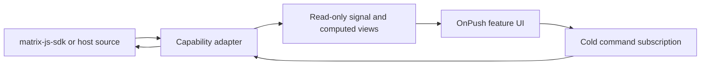
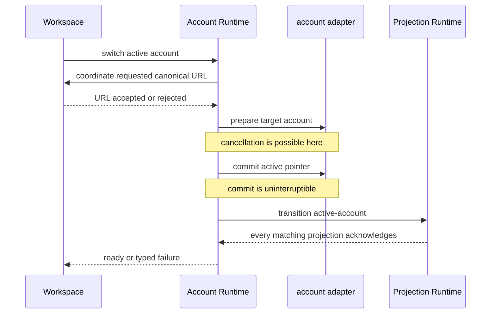

# State and reactivity

Trinity keeps Matrix state in matrix-js-sdk and projects it into application
state. It does not keep a second Redux or entity store. A data-access
capability listens to the authoritative SDK or host source, publishes a
read-only Angular signal, and rebuilds that signal when the source changes.

Use signals for current state a template renders. Use cold RxJS Observables for
one-shot commands that may fail, be cancelled, or need a typed outcome.
Components subscribe for their own lifetime, normally with
takeUntilDestroyed. They do not write another capability's signal or hold an
SDK client.

## The current-state and command boundary



An accepted command does not manually invent a replacement read model. The SDK
event or host callback is projected back into the read-only view. An adapter
can handle an explicit local-echo exception, but a routine write followed by a
hand-written refresh usually means the projection is missing an invalidation
source.

The application is zoneless and its pages and components use OnPush change
detection. A signal write schedules the relevant render. For rendering tests,
use the repository test helper rather than assuming a zone-driven Angular test
environment; [testing](../contributing/testing.md) documents the distinction.

## Projection Runtime

Projection Runtime is the kernel for lifecycle-bound read models. It accepts
four closed scopes: active account, all live accounts, exact account, and exact
conversation. A definition supplies an attachment function, a reconciliation
Observable, a reset function, and optional deterministic resource counts.
The runtime supplies the lifecycle rules:

- it coalesces an invalidation burst to one reconciliation in a microtask;
- every reconciliation has a generation, and a late generation cannot publish;
- it cancels cold reconciliation work when invalidated, replaced, or released;
- it detaches the exact listeners it attached, cancels queued work, and resets
  the owned read model on release; and
- it provides a cold finite readiness barrier with waitFor for a scope.

A capability owns the meaning of its projection. Projection Runtime owns the
attachment, reset, cancellation, and acknowledgement mechanics. It therefore
cannot become a product event bus or a second Matrix store. Its
[service](../../libs/runtime/projection/src/lib/projection-runtime.service.ts)
is the canonical lifecycle implementation.

### Writing a client-backed projection

For an active-client Matrix projection, use
[projectFromClient](../../libs/data-access/matrix-client/src/lib/project-from-client.ts)
rather than recreating listener ownership. Give it a stable ID, rebuild from
the supplied client instance, and list only events that invalidate that model.
It attaches to a client instance, not a connected boolean, coalesces a sync
burst, reprojects across the active-account boundary, and resets on release.
A bespoke listener must be removed by its matching unbind function. For a
selected-account Room Library projection, use its
[cold owned lifetime](../../libs/data-access/room-library/src/lib/selected-room-library.service.ts)
so its attachment and exact cleanup share one subscription.

### Active-account transition

transition(active-account) is the reattachment boundary. It cancels each
matching generation, detaches and resets the old adapter, attaches the new
authoritative source, reconciles it, and finishes only after every new
generation has acknowledged. A caller must wait for this barrier before
publishing a view that relies on active-account projections.

The Room Library lifetime uses this mechanism for its required account-aware
projections. It publishes prepared only after its room, Space, invitation,
hierarchy, and selected projections are ready. If it blocks, Workspace does not
restore a destination against an unprepared library.

## Account lifecycle

Account Runtime owns saved-account restoration, authenticated establishment,
the active account, sign-out, and installation reset. Authentication produces
an opaque authenticated grant; it does not hand a serializable session or an
SDK client to a screen.

Restoration is a cold, finite operation. It first sweeps orphaned stores and
reads the secret-safe saved registry; neither step consumes an account's
deadline. It orders the active account first, then restores accounts with the
current policy of a 30-second per-account deadline and concurrency of four.
Each account reports ready, reauthentication-required, timed-out, or a typed
failure. The overall result distinguishes no saved accounts, unavailable local
state, an unavailable active account, and an active account restored while
inactive accounts failed.

Cancellation releases work that has not committed through the Matrix runtime
rollback path while keeping already committed accounts represented in the
cancelled runtime state. Restoration rejects a concurrent establishment, switch or sign-out/reset
operation with transition-in-progress. It does **not** join or reject a second restoration:
each subscription starts another attempt, so Application Runtime must retain one restore owner.
Establishment, switching and lifecycle commands apply their own conflict guards. See the
[restore policy and runtime service](../../libs/data-access/accounts/src/lib/account-runtime.service.ts)
and its [resolved defaults](../../libs/data-access/accounts/src/lib/account-runtime.adapter.ts).

An authenticated establishment intent is explicit: the account is active or
inactive, live accounts are kept or replaced when active, and the saved record
is new or upserted. The production adapter persists the record without moving
the active pointer, starts and verifies the Matrix runtime, then commits active
placement. A pointer-commit failure stops and removes the newly started client
without wiping its stores and restores the prior pointer when needed. Inactive
placement requires an existing active account and never moves either pointer.
Account Runtime joins a repeated identical establishment, rejects a conflicting
one, and lets the same grant retry a registered startup failure without making
a second new-record write. It is the only owner that turns the opaque grant into
persisted account state and a live Matrix runtime. See the
[Matrix account adapter](../../libs/data-access/accounts/src/lib/matrix-account-runtime.adapter.ts).

Sign-out and installation reset are similarly serialized account lifecycle
commands; partial-cleanup outcomes name a safe cleanup scope and recovery
without leaking values.



For an active-account change, Workspace supplies the pre-commit coordination.
Workspace projects the requested canonical destination before Account Runtime
asks its adapter to prepare the target account; if route projection is rejected,
no commit happens. Once preparation succeeds, Account Runtime
announces the commit boundary, commits the persisted and live active pointer,
and waits for the active-account projection barrier. A caller that unsubscribes
before commit cancels preparation. Once commit begins, the workflow remains
owned until it settles; repeated identical switches join it and conflicting
switches are rejected.

Authenticated establishment follows the same ownership rule. Account Runtime
receives the opaque grant and an intent that states placement. It establishes
the account and returns a typed outcome; route code does not persist tokens or
invent a second active-client lifecycle.

## Workspace and Conversations

Workspace owns semantic navigation. Its view has an exact account, scope,
room, pane, and optional event target. It resolves user actions, quick
switches, history, restore, and repair into that view; it owns canonical URL
projection and repair, history policy, account activation, account readiness,
and focused Conversation selection.

Before a transition it repairs an unavailable Space or room to the recent list,
and a conversation pane without a room to the list pane. A restore that already
has the canonical URL does not navigate again. For an account change, it
projects the requested route as cancellable pre-commit work; a rejected route
prevents the commit. If preparation or a later account transition fails after a
route projection has started, Workspace restores the previous URL with replace
history. Router navigation can outlive RxJS teardown, so cancellation owns a
replacement navigation and keeps the attempt reserved until URL repair settles.
After the Account commit boundary, the attempt stays subscribed through its
terminal outcome even when the initiating page goes away. It publishes the
Workspace view and focuses the Conversation only after Account readiness and
canonical navigation settle.

User destinations push browser history. Restoration, canonicalization, and
unavailable-room or unavailable-Space repair replace it. Responsive layout only
changes where a pane is presented; it does not create a second semantic
destination or history entry.

Host-local popovers, sheets, and alerts dismiss first. Workspace then offers
Back in a stable semantic order: application surface, Room surface, compact
Conversation, then browser history and host root as fallthroughs. The newest
registration wins only within the same semantic layer. The
[Workspace transition workflow](../../libs/application/workspace/src/lib/workspace-transition.workflow.ts),
[intent resolver](../../libs/application/workspace/src/lib/workspace-navigation.resolver.ts),
and [Back service](../../libs/application/workspace/src/lib/workspace-back.service.ts)
are the canonical seams.

Room-shell code is a presentation adapter: it passes semantic intent, cleans up
overlays, and renders typed outcomes. It does not own a hidden second route,
active account, Room selection, or global timeline.

Conversation Runtime owns the lifetime of an immutable timeline handle for
one account-and-room key. It never retargets after an active-account switch and
exposes the stable focused timeline proxy instead of a root TimelineService.
Each handle has one main TimelineService child and exposes bound compose,
message, media, thread, pin, and search surfaces for that same key. Temporary
thread children are released with focus changes and handle teardown. The broader
Conversations capability owns the product contracts of compose, message
presentation, relations, media, threads, pins, and search; the runtime owns
their exact timeline-lifetime attachment and retention. The
[Conversation Runtime source](../../libs/data-access/timeline/src/lib/conversation-runtime.service.ts)
is the canonical seam.

Compose snapshots the exact key, text, and intent when a command is subscribed.
It suppresses a duplicate active send and only clears its persisted draft after
the Matrix adapter accepts the event into the authoritative local timeline.
Typed rejection restores the draft. Message relations, redactions, reactions,
receipts, media retry, threads, and pins use the same exact account-and-room
identity; successful commands await the authoritative SDK projection instead of
writing optimistic room authority.

Send cancellation has a separate safety contract. The
[compose controller](../../libs/data-access/timeline/src/lib/conversation-compose.ts)
restores the captured draft after a confirmed cancellation or typed rejection only while its
revision still matches, preserving text entered since submission. An adapter defect or a send
that cannot be confirmed cancelled is indeterminate; treating it as a definite failure would
invite a duplicate. Unsubscription alone is not proof that the server rejected the event.

[Media Pipeline](../../libs/data-access/media/src/lib/media-pipeline.service.ts) aborts in-flight
uploads on teardown and retains reusable completed uploads. An uncertain event send keeps its
transaction ID for server deduplication, reusing an eligible pending event rather than adding
a second one. Confirmed pending-event cancellation rotates the transaction ID; changing a
caption likewise requires cancelling the eligible pending event before allocating a new ID.
An event still sending cannot be treated as safely cancelled or rewritten. These rules retain
the exact Account, Room and thread target across retries.

Focus enables foreground effects such as typing, receipts, and room actions.
Blur leaves the bounded main timeline warm but releases threads, pins, and
search so potentially room-sized projections are not retained. At most two
blurred handles per account remain in least-recently-used order. Eviction
permanently retires a handle and destroys its child injector; reopening the
same room constructs a fresh exact handle.

When a create or invite succeeds before sync has published the room, Workspace
waits on Room Library's bounded exact-account readiness barrier before it
focuses the Conversation. The barrier has typed failure metadata and removes
its listeners on success, failure, or timeout. Workspace therefore does not
focus a placeholder Conversation or wait indefinitely.

## Preferences and Trust

Preferences Store is a policy-free, typed descriptor catalogue with
context-keyed signal state. A capability owns each descriptor's default,
validation, migration, sensitivity, editor metadata, and scope. The supported
scopes are installation, account, conversation, and server-authoritative;
a descriptor may be used only with its matching context.

Hydration, set, and reset are cold finite operations. The store publishes a
ready value or a safe failure state with the descriptor default. Storage and
export policy stay in adapters, so diagnostics never expose a preference
value. A failed write keeps the committed signal value visible and reports a
typed recovery outcome rather than replacing it with an uncommitted candidate.

Trust is a session-owned capability, not a route-local effect. Its lifetime
uses active-account projections for trust health and verification state and
refreshes health during preparation. The detailed recovery, verification, and
cryptographic rules belong in
[Matrix and encryption](matrix-and-encryption.md); Workspace and a crypto
screen consume Trust's public state and commands.

## Change and check routes

Use this sequence when altering a reactive capability:

1. Identify the authoritative source and its owning capability.
2. Decide whether the change is state (a projection) or a one-shot command.
3. For a lifecycle-bound projection, define its closed scope, exact invalidation
   sources, reconciliation, reset, and resource counts.
4. State how account switching, release, cancellation, and a late asynchronous
   result behave before adding the adapter.
5. Expose a read-only model and cold command API from the library index.
6. Run the resolved owner's tests, typecheck, and lint target, then the
   relevant browser or host journey.

```bash
pnpm nx show project data-access-accounts --json
pnpm nx show project application-workspace --json
pnpm nx test data-access-accounts
pnpm nx typecheck application-workspace
pnpm nx lint projection-runtime
```

Use the actual targets reported by Nx; not every project has the same target.
For command forwarding, complete validation selection, and real-browser
coverage, see [contributing commands](../contributing/commands.md) and
[testing](../contributing/testing.md).

## Current contracts, not migration history

The lifecycle described here is the current public contract. The rationale
for its seams belongs in the relevant
[architecture decision record](../adr/0003-account-and-conversation-runtime-seams.md).
[Final validation](final-validation.md) is dated evidence only. Do not preserve
an obsolete owner by adding a compatibility import: move callers to the current
capability API and update the generated dependency map when the resolved graph
changes.
